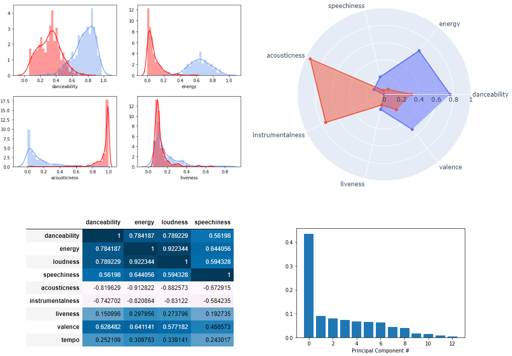
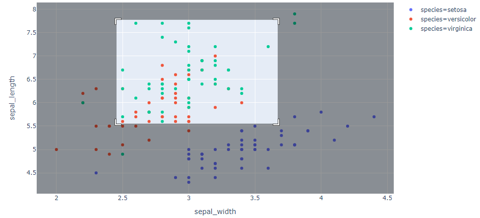
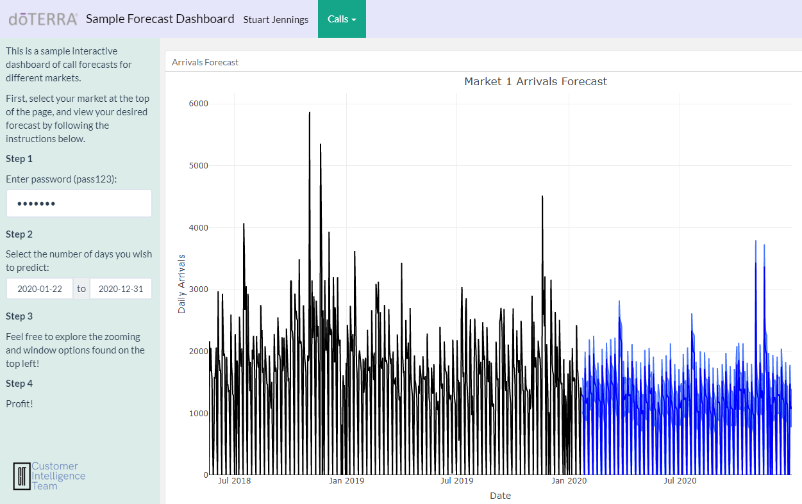

## Portfolio

---

### Machine Learning 

[Spotify Genre Classification](https://github.com/stujenn/genre-classifier)

---

### Data Visualization

---
[Plotly Dash Tutorial](https://github.com/stujenn/dash-ex)

---
[R Shiny Dashboard](https://stu-jenn.shinyapps.io/sample_dash/)

---

---

Page template forked from <a href="https://github.com/evanca/quick-portfolio">evanca</a>

<!-- Remove above link if you don't want to attibute -->
